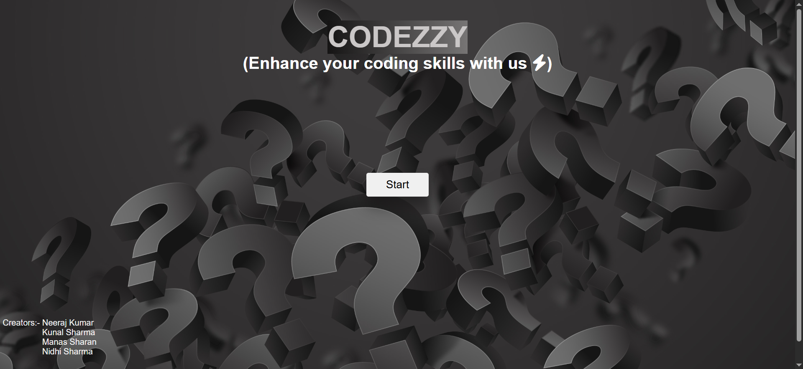
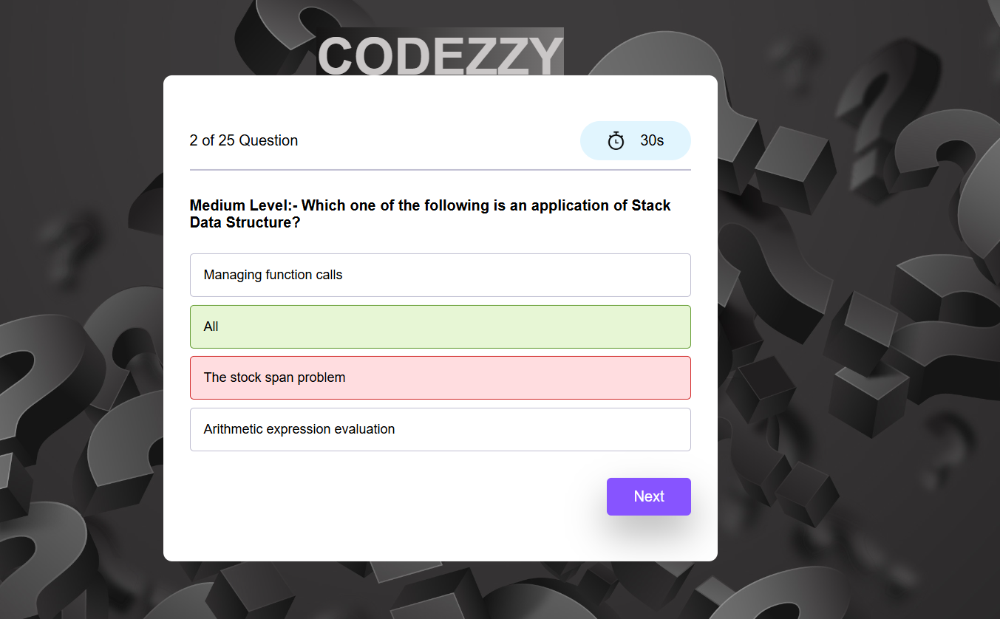

# 🧠 Mini Project – Web-Based Quiz App

<p align="center">
  
</p>

<p align="center">
  
</p>


An interactive **Quiz Application** developed as a **Mini Project** in the second year using **HTML**, **CSS**, and **JavaScript**. It features timed multiple-choice questions from various domains like **Programming, HTML, CSS, and JavaScript**, with difficulty levels labeled as Easy, Medium, and Hard.

---

## 🌐 Live Demo

🔗 [Try Now](https://neerajkumar151.github.io/Mini-Project/)

---

## ✨ Features

- 🧩 25 curated questions across **Programming**, **HTML**, **CSS**, and **JavaScript**
- ⚡ 30 seconds timer for each question
- 🔁 Questions and options change order on every playthrough
- 🧠 Difficulty tags: **Easy**, **Medium**, **Hard**
- 📊 Final score displayed at the end to track your improvement
- 📱 Fully responsive and mobile-friendly UI

---

## 🧑‍💻 Tech Stack

| Technology   | Description                        |
|--------------|------------------------------------|
| HTML5        | Page structure                     |
| CSS3         | Styling and layout                 |
| JavaScript   | Timer, logic, scoring, interaction |
| GitHub Pages | Deployment                         |

---

## 📂 Folder Structure

Mini-Project/
│
├── index.html # Main quiz page
├── style.css # Styles for layout and UI
├── script.js # Core logic and interactivity
├── assets/ # Images and preview screenshot
│ └── preview.png # (Optional) Screenshot for README
└── README.md # Project documentation


---

## 🚀 How to Run Locally

1. **Clone the repository**
```bash
git clone https://github.com/Neerajkumar151/Mini-Project.git
```
2. **Navigate to the project folder**
```bash
cd Mini-Project
```
3.**Open index.html in your browser**

---

## 🌍 Deployment

This project is hosted on **GitHub Pages**  
🔗 [Click to Visit](https://neerajkumar151.github.io/Mini-Project/)

---

## 🔮 Future Plans

- Add more questions and categories  
- Include a timer bar visualization  
- Add sounds and animations for correct/wrong answers  
- Store high scores using localStorage or backend  
- Add a leaderboard and multiplayer mode  

---

## 🙋‍♂️ About Me

**Neeraj Kumar**  
🎓 Final Year B.Tech IT Student  
🏫 GL Bajaj Institute of Technology & Management, Greater Noida  
🌐 [GitHub Profile](https://github.com/Neerajkumar151)

---

## ⭐ Show Some Love

If you like this project:

- ⭐ Star the repo  
- 📌 Share it  
- 📥 Fork it  
- 💡 Contribute your ideas  

---

## 📄 License

This project is licensed under the [MIT License](https://opensource.org/licenses/MIT).

